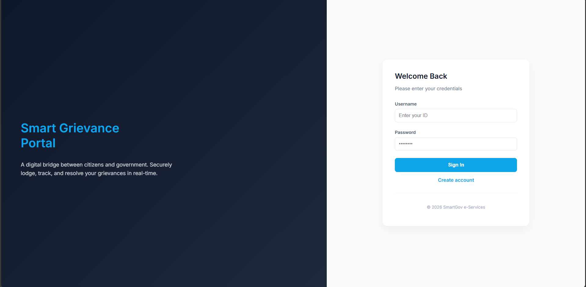
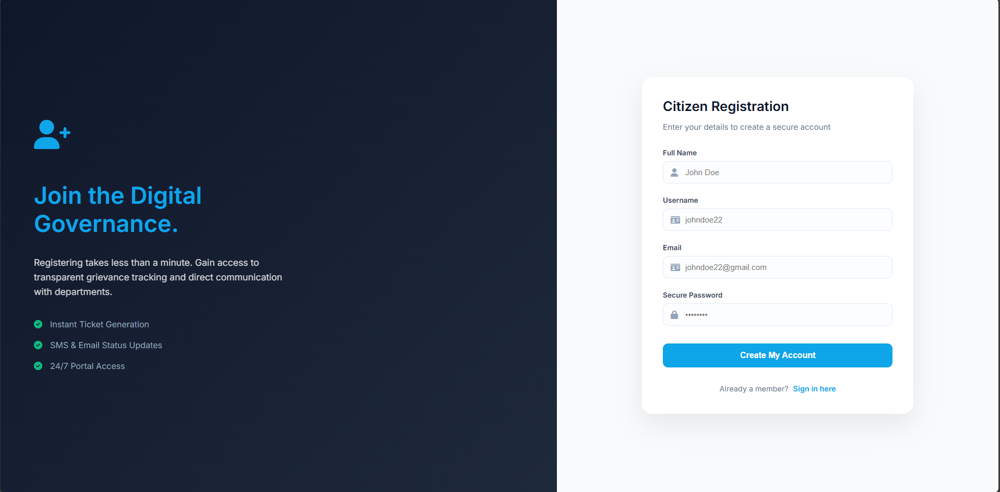
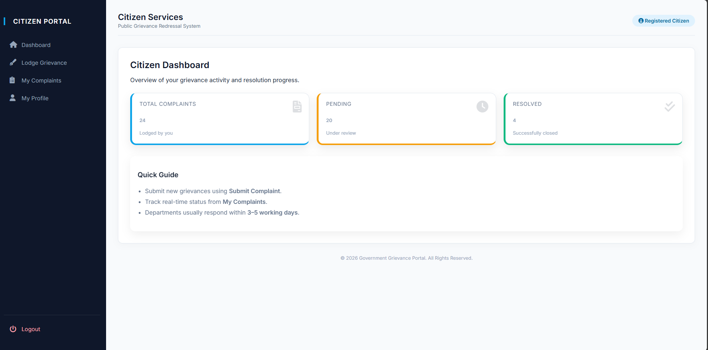
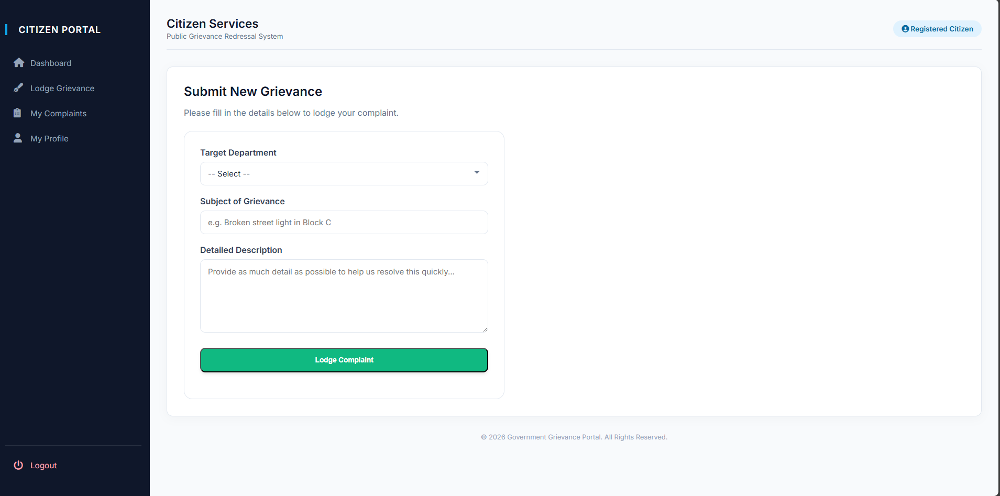
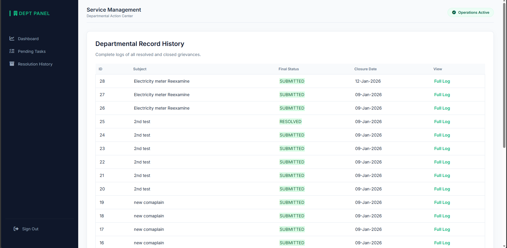
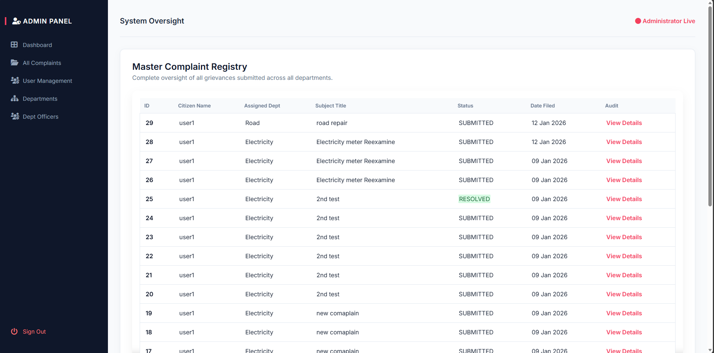

# Complaint / Grievance Management System (ASP.NET WebForms + SQL Server)

A role-based Complaint / Grievance Management Portal built using **ASP.NET WebForms (Visual Studio 2010)** and **SQL Server 2008**.  
This system allows citizens to submit complaints, departments to resolve them, and admins to monitor and manage the complete workflow.

---

## ✨ Features

### 👤 Citizen (USER)
- Register & Login
- Submit new grievance/complaint
- View submitted complaints
- Complaint details with status history
- Profile page (view/edit basic details)
- Forgot password (learning flow)

### 🏢 Department Officer (DEPT)
- View pending complaints assigned to their department
- Update complaint status (IN_PROGRESS / RESOLVED)
- Add remarks while updating status
- View resolution history

### 🛡 Admin (ADMIN)
- View all complaints (master registry)
- View complaint details
- Manage departments (Add / Activate / Deactivate)
- Create department users (DEPT officers)
- Reports:
  - Date-wise report
  - Status-wise report
  - Department-wise report

---

## 🧰 Tech Stack
- ASP.NET WebForms (C#)
- SQL Server 2008
- ADO.NET (SqlConnection, SqlCommand, SqlDataReader)
- HTML / CSS (modern UI)
- Session-based authentication
- Master Pages for UI layout

---

## 🗃 Database Setup

### Step 1: Create Database
Create a database named:

### Step 2: Run SQL Scripts
Run scripts in this order:

1. `Database/CreateTables.sql`
2. `Database/SeedData.sql`

---

## 🔑 Default Login Credentials (Seed Data)

| Role  | Username   | Password  |
|------|------------|-----------|
| ADMIN | admin      | admin123  |
| DEPT  | dept_elec  | 123       |
| USER  | user1      | 123       |

---

## 🖼 Screenshots

### Login

### Register

### User Dashboard

### Submit Complaint

### Department Pending Complaints

### Admin - All Complaints

---

## ▶ How to Run (Local Setup)

1. Open project in **Visual Studio 2010**
2. Restore required references (if any)
3. Update connection string in `Web.config`
4. Run project (`F5`)

---

## 📌 Future Improvements
- Password hashing
- OTP based password reset
- Email notifications on status change
- Export reports to Excel/PDF

---

## 👨‍💻 Author
**Mohammad Sahil**  
GitHub: [MohammadSahil018](https://github.com/MohammadSahil018)
